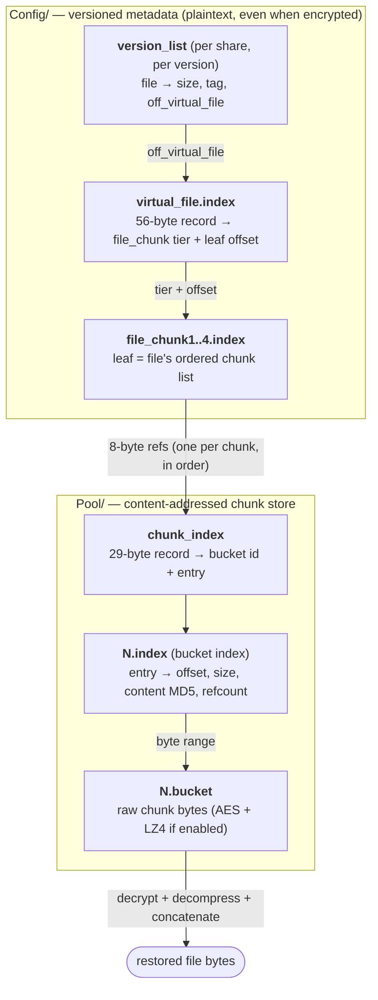

# Synology HyperBackup Cloud Image Format

> [!NOTE]
> This research is intended to identify which HyperBackup chunks are required
> for each restore point, so chunks that are not currently needed can be moved
> to the Azure Archive tier and later rehydrated before restore when needed.
> The analysis was performed on my own backups, without leaked Synology source
> code or confidential materials. This document describes observed behavior and
> file formats, not copied Synology implementation code.

Reverse-engineered from HyperBackup 4.1.2-4045 backups of a DS918+ NAS targeting
Microsoft Azure Blob Storage. Two backup sets were analyzed:

1. **Unencrypted/uncompressed** — `data_compress_type=0`, `enable_data_encrypt=false`
2. **Encrypted + compressed** — `data_compress_type=1`, `enable_data_encrypt=true`

Both backed up the same source folder. The encryption/compression variant is
documented alongside the base format throughout this document.

---

## Table of Contents

1. [Overview](#overview)
2. [Test Data](#test-data)
3. [Repository Directory Layout](#repository-directory-layout)
4. [Top-Level Metadata](#top-level-metadata)
5. [Config Layer](#config-layer)
6. [Pool Layer (Data Storage)](#pool-layer-data-storage)
7. [Binary Index Format (`7053 a86e`)](#binary-index-format-7053-a86e)
8. [File Pool Format (`e235 abc8`)](#file-pool-format-e235-abc8)
9. [Guard Layer (Cloud Sync Tracking)](#guard-layer-cloud-sync-tracking)
10. [Control Layer](#control-layer)
11. [Encryption and Compression](#encryption-and-compression)
12. [Data Recovery Walkthrough](#data-recovery-walkthrough)
13. [Naming Conventions](#naming-conventions)
14. [SQLite Database Schemas](#sqlite-database-schemas)
15. [License](#license)

---

## Overview

HyperBackup's "cloud image" format (`formatType=cloud_image`) is a
deduplication-based, versioned backup system. Data is split into chunks identified
by MD5 hashes, stored in numbered "buckets" under a Pool directory. Metadata is
tracked across multiple SQLite databases and custom binary index files.

Two layers make up a repository: a **`Config/` metadata layer** that lists each
version's files and points each file at its chunk list, and a **`Pool/` content-
addressed store** where deduplicated chunks live in buckets. Restoring a file means
walking from its metadata record down to the physical chunk bytes:



Deduplication falls out of this shape: many files' chunk lists can point at the same
`chunk_index` entry (its `refcount` counts the references), so identical content —
across files or backup versions — is stored only once.

### Key Design Principles

- **Content-addressed storage**: Every chunk is identified by its MD5 hash (16 bytes).
- **Deduplication**: Identical chunks across files and versions are stored once.
  Controlled by `support_cross_file_dedup=true` in task config.
- **Versioned snapshots**: Each backup run creates a version with per-share file
  listings, enabling point-in-time restore.
- **Two-tier storage**: Small files (<=1024 bytes by default) are stored as chunks
  in buckets. Large files go to a separate file pool as XZ-compressed blobs.
- **Cloud-aware**: Guard databases track upload state for resumable transfers.
- **Optional encryption**: AES-256-CBC for data, with per-version keys wrapped by
  NaCl `crypto_box_seal` (X25519 + XSalsa20-Poly1305 sealed boxes; see
  [Encryption and Compression](#encryption-and-compression)). Encrypts chunk data,
  filenames, and config values while leaving SQLite schemas/structure in the clear.
- **Optional compression**: LZ4 block compression applied before encryption.

### Format Identifiers

| Field | Value |
|-------|-------|
| `bkpVersion` | `2` |
| `formatType` | `cloud_image` |
| `bkpType` | `cloud` |
| Index format | `{"major":0,"minor":9,"sub_minor":1}` |
| Target format | `{"major":0,"minor":3,"sub_minor":0}` |

---

## Reference Implementation (PoC)

A working .NET 10 proof-of-concept that reads this format lives in [`src/`](src/): a CLI exposing four core capabilities:
  1. `list` — enumerate every file in a backup version (decrypting filenames)
  2. `restore` — restore a file's bytes (verified end-to-end on the unencrypted
     sample *and* on a real encrypted Azure backup, including multi-chunk and
     deduplicated files)
  3. `archive-plan` — decide which blobs can move to the Azure Archive tier
  4. `rehydrate` — determine and rehydrate the exact blob(s) needed for one file

  plus `info`, `demo`, and the raw-blob `ls` / `get` discovery helpers. See
  [Using the Reference Implementation](#using-the-reference-implementation).

```bash
dotnet run --project src/HyperBackup.Cli -- <command> [storage] [options]
```

---

## Using the Reference Implementation

### Requirements & build

Only the **.NET 10 SDK** is required. The tool shells out to nothing — every
format dependency is a NuGet package: XZ via **SharpCompress**, LZ4 via
**K4os.Compression.LZ4**, NaCl sealed boxes via **Sodium.Core**, SQLite via
**Microsoft.Data.Sqlite**, and Azure via **Azure.Storage.Blobs**.

```bash
dotnet build HyperBackup.slnx
```

Run any command with `dotnet run`:

```bash
dotnet run --project src/HyperBackup.Cli -- <command> [storage] [options]
```

The examples below abbreviate that as `hbk`; define the alias once if you like:

```bash
alias hbk='dotnet run --project src/HyperBackup.Cli --'
```

Add `--verbose` to any command to print a full stack trace on error.

### Storage selection

Pick exactly one backend:

```bash
# Local folder on disk
--local <dir>

# Azure Blob Storage (account + key)
--azure-account <account> --azure-key <key> [--azure-container <name>] [--azure-prefix <prefix>]

# Alternative Azure credentials
--azure-connection-string <cs>   # or env HBK_AZURE_CONNECTION_STRING
--azure-sas <containerSasUrl>    # or env HBK_AZURE_SAS
```

Secrets may be supplied via environment variables instead of flags:
`HBK_AZURE_KEY`, `HBK_AZURE_CONNECTION_STRING`, `HBK_AZURE_SAS`. The
`--azure-prefix` is the repository folder inside the container (e.g.
`synology_1.hbk`).

### Encryption

```bash
--rsa-key <file>        # path to the exported 32-byte X25519 private key
                        #   (the "..._private.pem" file — raw bytes; for cloud backups)
--passphrase <p>        # backup passphrase (decrypts local-format encKeys.1); or env HBK_PASSPHRASE
```

Despite the flag name `--rsa-key`, the file is the raw 32-byte X25519 private
key (see [Encryption and Compression](#encryption-and-compression)).

### Commands

| Command | What it does |
|---------|--------------|
| `info` | Show format, encryption/compression flags, key availability, and versions |
| `list [--version N] [--all]` | List files in a version (decrypts filenames when keys are available); `--all` includes EA-metadata entries |
| `restore --version N --file <name-or-path> [--out <file>]` | Restore one file's bytes and verify MD5 + size |
| `archive-plan [--hot-version N ...] [--execute]` | Decide which blobs can move to Azure Archive (keep metadata Hot, archive bulk data); `--execute` performs the tier change |
| `rehydrate --version N --file <name> [--execute] [--priority high]` | Determine and rehydrate the exact blob(s) one file needs |
| `demo` | End-to-end showcase on the local sample |
| `ls [--prefix p] [--limit N]` | Raw blob listing with sizes/tiers (discovery, no parsing) |
| `get --blob <repo-path> [--offset O --length L] [--out <file>]` | Download one blob, optionally a byte range (offset+length together, else the whole blob) |

Examples:

```bash
hbk info    --local target-azure-azure-nopassword
hbk list    --local target-azure-azure-nopassword
hbk restore --local target-azure-azure-nopassword --version 1 --file test.txt
hbk ls      --local target-azure-azure-nopassword --limit 50
```

### Worked example 1 — local unencrypted sample

```bash
# Full end-to-end showcase (overview → list → archive-plan → rehydrate → restore)
hbk demo --local target-azure-azure-nopassword

# Restore a single file and verify it
hbk restore --local target-azure-azure-nopassword --version 1 --file test.txt --out restored/test.txt
```

### Worked example 2 — encrypted Azure backup

Secrets live in a gitignored `secrets/` directory; pass them by path or env so
they never land in the shell history or this README. Use your own values for
the `<account>` / `<container>` placeholders.

```bash
# Inspect the backup (format, encryption, versions, whether keys resolved)
hbk info \
  --azure-account <account> --azure-key "$(cat secrets/azure.key)" \
  --azure-container <container> --azure-prefix synology_1.hbk \
  --rsa-key secrets/private.pem

# Restore one file from the encrypted backup
hbk restore \
  --azure-account <account> --azure-key "$(cat secrets/azure.key)" \
  --azure-container <container> --azure-prefix synology_1.hbk \
  --rsa-key secrets/private.pem \
  --version 1 --file test.txt --out restored/test.txt
```

### Status / limitations

Tested against an encrypted and an unencrypted Synology backup on Azure, with
restores checked byte-for-byte against the original source files.
(The repo also bundles a tiny two-file sample under `target-azure-*/` for offline
reproduction; the larger figures below come from those real backups, not that sample.)

- `list` (including correctly decrypted filenames),
- `restore` of **single-chunk, multi-chunk, large, deduplicated, and cross-version
  files** — e.g. a 67 MB / 8,635-chunk file, and after editing it across backup runs
  an 8,643-chunk version that reuses the unchanged chunks and adds only the new ones,
  both restored MD5-identical to source; a non-contiguous PDF that reuses chunks
  internally; on an encrypted backup, a 9.8 MB / 1,251-chunk deduplicated file and
  split-archive parts of *identical size* each restored to their distinct, correct
  originals (MD5 + size verified on every restore),
- `archive-plan`, and
- per-file `rehydrate` (resolves every bucket a file's chunks span).

How a file's chunks are resolved (see [Chunk Manifest](#chunk-manifest)): the
file's `off_virtual_file` points to its `virtual_file.index` record, which names the
exact `file_chunk{tier}.index` leaf holding its **ordered chunk list** (one flat
value, however long — no size cap), and each entry is resolved through `chunk_index`
to a `(bucket, entry)` and thus a physical chunk. This is authoritative and handles
deduplicated/non-contiguous files and files that merely share a size. All of these
indexes are plaintext even in encrypted backups. Coverage on those two real backups:
**13/13** content files resolve in the unencrypted one and **2,493/2,494** in the
encrypted one.

Remaining gaps:

- **Multi-segment chunk lists.** Rare: a `virtual_file.index` record can carry
  `count = 2`, meaning its chunk list is split into two non-adjacent segments. Normal
  incremental backups instead rewrite a file's whole chunk list as a single leaf
  (`count = 1`), so this is uncommon — 1 of 2,494 files in the encrypted backup, none
  in the unencrypted one. Only the first segment is located; the placement of
  segment 2 is not decoded, so the size/contiguous fallbacks cover this case.
- **Tagless `@AppConfig` system files** (e.g. `_Syno_TaskConfig`) are not restored
  (not user data), though their chunk lists are present in the index.
- The **file-pool internal segmenting** is only partially understood.

---

## Test Data

The backup was created from this source directory on a Synology DS918+:

```
/Video/hyperbackup-test/
  test.txt       5 bytes  "hello"
  dir/
    test2.txt    5 bytes  "world"
```

The backup also includes Synology system files (`@AppConfig` share) and extended
attribute streams (`@SynoEAStream` / `@eaDir` entries) for each file/directory.

---

## Repository Directory Layout

The top-level backup directory on Azure is named `synology_1.hbk`. The full
tree structure:

```
synology_1.hbk/
  _Syno_TaskConfig                      # INI: backup task configuration
  SynologyHyperBackup.bkpi              # Empty marker file (identifies repo)
  synobkpinfo.db                        # SQLite: backup identity & flags
  storage_statistics.db.2               # SQLite: per-version statistics
  test.txt                              # (see note below)
  dir/
    test2.txt                           # (see note below)

  Config/
    index_ver.json.1                    # Index format version
    target_ver.json.1                   # Target format version
    target_info.db.1                    # SQLite: target state
    target_recover.info.1               # 8-byte recovery marker
    version_info.db.2                   # SQLite: version registry (core)
    @Share/
      @AppConfig/
        1.db.2                          # SQLite: file listing, version 1
        complete_list.db.2              # SQLite: completion tracking
      Video/
        1.db.2                          # SQLite: file listing, version 1
        complete_list.db.2              # SQLite: completion tracking
    file_chunk1.index/0.idx.2           # Binary index: per-file chunk lists, tier 1
    file_chunk2.index/0.idx.2           # Binary index: per-file chunk lists, tier 2
    file_chunk3.index/0.idx.2           # Binary index: per-file chunk lists, tier 3
    file_chunk4.index/0.idx.2           # Binary index: per-file chunk lists, tier 4
    virtual_file.index/0.idx.2          # Binary index: per-file record + chunk-list pointer

  Pool/
    bucketID.counter.2                  # 8-byte BE int: next bucket ID (=3)
    0/0/
      0.bucket.2                        # Raw chunk data (bucket 0)
      0.index.2                         # Chunk index for bucket 0
      1.bucket.2                        # Raw chunk data (bucket 1)
      1.index.2                         # Chunk index for bucket 1
      2.bucket.2                        # Raw chunk data (bucket 2)
      2.index.2                         # Chunk index for bucket 2
    chunk_index/
      0.idx.2                           # Global chunk table (29-byte records: bucket+entry+refcount)
    file_pool/
      1.file.2                          # XZ-compressed large file blob
      file_pool_map.db.2                # SQLite: file pool checksum map
      file_id.counter.2                 # 8-byte BE int: next file ID (=2)

  Control/
    @writer/
      v1.cformat                        # Empty: format version marker
      v1.2.-1.0.0.none.none.cinfo       # Empty: writer state marker

  Guard/
    cloud/
      0_file.db.2                       # SQLite: cloud file upload tracker
      0_bucket.db.2                     # SQLite: cloud bucket upload tracker
```

> **Note on `test.txt` and `dir/test2.txt` at root level**: These appear as
> actual files in the Azure container at the repository root. This seems to be
> a quirk of how HyperBackup uploads to Azure -- the raw user files exist
> alongside the backup metadata, but the authoritative data lives in the Pool
> buckets.

When encryption is enabled, two additional files appear:

```
  Config/
    encKeys.1                           # 16-byte header (no key material in cloud format)
    public.pem.1                        # 32-byte X25519 public key (raw, not PEM text)
  Pool/
    vkey.db.2                           # SQLite: sealed-box-wrapped per-version keys
```

All other files exist in the same paths with the same structure.

---

## Top-Level Metadata

### `_Syno_TaskConfig` (INI format)

The task configuration file describes the backup job:

```ini
[task_config]
backup_folders=["/Video/hyperbackup-test"]
backup_data_type="data"
data_compress_type=0                    # 0 = no compression
enable_data_encrypt=false
enable_xattr=true
support_cross_file_dedup=true
source_model="DS918+"
host_name="synology"
name="Microsoft Azure 1"
target_dir="synology_1.hbk"
repo_id=9
create_time=1774897149
unikey="001132A9310A_9_1774897149"      # MAC_repoID_createTime
linkkey="synology_001132A9310A_9"
```

Key fields:
- `data_compress_type`: `0`=none, `1`=LZ4 compression
- `enable_data_encrypt`: controls AES-256-CBC encryption of chunk data and filenames
- `enable_xattr`: backs up extended attributes as `@SynoEAStream` files
- `unikey`: globally unique identifier using NAS MAC address (`MAC_repoID_createTime`)

When encryption is enabled, `backup_folders` and `backup_filter` are wrapped
in `/*eNC00*<base64>*/` envelopes (see
[Config Value Encryption](#config-value-encryption)):

```ini
enc_backup_folders="/*eNC00*Urc2c9+qLVLe45nP4P6pqPjgVZAwp8QpLmQMmg==*/"
enc_backup_filter="/*eNC00*2reF14Pn1CzbM0+e/70GUCP8noWTJvWQI4+JIuPzcaobSdY=*/"
```

The plaintext `backup_folders` and `backup_filter` fields are replaced with
empty values (`[]` and `{}`), and the encrypted versions are stored in
`enc_backup_folders` and `enc_backup_filter` instead.

### `synobkpinfo.db` (SQLite)

Identity database with two tables:

**`task_id_tb`**: Single row with the task identifier.

| task_id |
|---------|
| `synology_001132A9310A_9` |

**`backup_info_tb`**: Key-value pairs for backup properties.

| info_name | info_value | Description |
|-----------|-----------|-------------|
| `dataUnique` | `001132A9310A_9_1774897149` | Unique backup identifier |
| `bkpAuthUser` | `HyperBackup` | Auth user for the backup |
| `bkpVersion` | `2` | Backup format version |
| `bkpType` | `cloud` | Target type (cloud/local/rsync) |
| `formatType` | `cloud_image` | Storage format |
| `dataEnc` | `F` | Encryption: F=off, T=on |
| `dataComp` | `F` | Compression: F=off, T=on |
| `enableXattr` | `T` | Extended attributes: T=on |

In an encrypted+compressed backup, `dataEnc` = `T` and `dataComp` = `T`.

### `SynologyHyperBackup.bkpi`

Empty marker file (0 bytes). Its presence identifies the directory as a
HyperBackup repository.

### `storage_statistics.db.2` (SQLite)

Tracks backup run statistics.

**`source_table`**: One row per backup version.

| Column | Example | Description |
|--------|---------|-------------|
| `start_time` | `1774897175` | Backup start (unix epoch) |
| `end_time` | `1774897191` | Backup end (unix epoch) |
| `source_size` | `80` | Total source data size (bytes) |
| `total_count` | `5` | Total files scanned |
| `new_count` | `5` | New files |
| `modify_count` | `0` | Modified files |
| `remove_count` | `0` | Deleted files |
| `compress_size` | `57172` | Size after compression (=uncompress when off) |
| `version_id` | `1` | References version_info |

**`target_table`**: Upload statistics.

| action_type | Meaning |
|-------------|---------|
| `3` | Initialization |
| `1` | Version backup upload |

---

## Config Layer

### `Config/version_info.db.2` (SQLite) -- Central Version Registry

This is the most important metadata database. Each backup version gets a row.

```sql
CREATE TABLE version_info (
  id INTEGER PRIMARY KEY AUTOINCREMENT,
  timestamp INTEGER,           -- Unix epoch of backup
  name TEXT,                   -- User-assigned version name
  source TEXT,                 -- JSON: what was backed up
  share TEXT,                  -- Comma-separated share names
  status TEXT,                 -- "Complete", "InProgress", etc.
  statistics TEXT,             -- JSON: detailed stats
  diff_size INTEGER,
  locked INTEGER DEFAULT 0,
  share_info BLOB,             -- Binary share metadata
  tag_db_magic BLOB,           -- 8-byte magic for tag DB
  tag_db_file_size_thr INTEGER,-- Threshold for inline tags (default 1024)
  has_suspend_dup INTEGER DEFAULT 0,
  suspend_history TEXT,        -- JSON: lifecycle events
  enc_cksum BLOB DEFAULT NULL,
  depose_time INTEGER DEFAULT -1
);
```

Example row for our test backup:

| Field | Value |
|-------|-------|
| `id` | `1` |
| `name` | `my_ver` |
| `status` | `Complete` |
| `share` | `@AppConfig,Video,` |
| `tag_db_file_size_thr` | `1024` |

The `source` JSON reveals the backup scope:
```json
{
  "share_path": ["/Video/hyperbackup-test"],
  "path_filter": {
    "/Video/hyperbackup-test": {"whitelist": ["**"]}
  }
}
```

The `statistics` JSON breaks down what was stored:
```json
{
  "compress_size": 57172,
  "new_chunk_size": 1880,
  "summary": {
    "share": {"new_cnt": 2, "new_size": 10},
    "ea":    {"new_cnt": 3, "new_size": 979},
    "app":   {"new_cnt": 2, "new_size": 56183}
  }
}
```

The `suspend_history` records lifecycle events:
```json
[
  {"client_time": 1774897180, "event": 1, "event_desc": "create"},
  {"client_time": 1774897190, "event": 6, "event_desc": "complete"}
]
```

### `Config/@Share/{ShareName}/{version_id}.db.2` -- Per-Share File Listings

Each backed-up share gets its own directory under `Config/@Share/`. Each version
produces a `{version_id}.db.2` file containing the complete file tree for that
share at that point in time.

```sql
CREATE TABLE version_list (
  name_id_v2 BLOB PRIMARY KEY,   -- 20-byte SHA-1 hash (file identity)
  pname_id_v2 BLOB,              -- 20-byte SHA-1 hash (parent directory)
  off_virtual_file INTEGER,      -- Offset into virtual file index
  file_name TEXT,                 -- File/directory name
  mtime_sec INTEGER,             -- Modify time (seconds)
  mtime_nsec INTEGER,            -- Modify time (nanoseconds)
  size INTEGER,                  -- File size in bytes
  ctime_sec INTEGER,             -- Change time (seconds)
  ctime_nsec INTEGER,            -- Change time (nanoseconds)
  mode INTEGER,                  -- Unix file mode
  dedup_id INTEGER,              -- Dedup reference
  version_id INTEGER,            -- Which backup version
  status TEXT,                   -- Entry status
  inode INTEGER,                 -- Source filesystem inode
  tag BLOB,                      -- 20 bytes: MD5(MD5(content))(16) + size_BE(4)
  cr_time INTEGER,               -- Creation time
  nlink INTEGER,                 -- Hard link count
  fs_id INTEGER,                 -- References file_system_list
  ...
);

CREATE TABLE file_system_list (
  fs_id INTEGER PRIMARY KEY AUTOINCREMENT,
  version_id INTEGER,
  device INTEGER,
  fs_uuid TEXT                   -- Filesystem UUID
);

CREATE TABLE setting (key TEXT PRIMARY KEY, value TEXT);
CREATE TABLE xattr (name_id_v2 BLOB PRIMARY KEY, name BLOB, value BLOB);
```

#### Name ID System

Files and directories are identified by 20-byte `name_id_v2` blobs (SHA-1
hashes). The directory hierarchy is formed through `pname_id_v2` parent
references. The root sentinel is:

```
5058F1AF 5058F1AF 8388633F 609CADB7 5A75DC9D
```

#### Tag System (Inline Small File Storage)

Files at or below `tag_db_file_size_thr` (1024 bytes) in user shares get a
20-byte `tag` blob that acts as the chunk locator:

```
Bytes 0-15:  MD5(MD5(content))   -- the double-MD5 dedup key (NOT the raw content MD5)
Bytes 16-19: File size (big-endian uint32)
```

The first 16 bytes are `MD5(MD5(content))` — `MD5` applied to the content's MD5, not
the raw content MD5. The [Type 2 bucket index](#type-2-bucket-chunk-index-pool00index2)
stores the *content* MD5, so a single-chunk file is located by computing
`MD5(content_md5)` for each bucket-index entry and matching it against `tag[0:16]`.
Because the bucket-index MD5 is always in the clear, this lookup also works for
encrypted backups.

Examples from the Video share (`tag` field shown = `MD5(MD5(content))`):

| File | `tag[0:16]` = MD5(MD5(content)) | content MD5 (in bucket index) | Size |
|------|--------------------------------|-------------------------------|------|
| `test.txt` | `62109206880D38A4010A98E11243924A` | `5D41402ABC4B2A76B9719D911017C592` (`md5("hello")`) | 5 |
| `test2.txt` | `6B1A0A0FFC1AA4313A9532C3D848B7A8` | `7D793037A0760186574B0282F2F435E7` (`md5("world")`) | 5 |
| `dir@SynoEAStream` | `78047B2E8DB0ABC675EB248CC2BAF67E` | `157B2B8B4D1D043832653A98F1ED6BF4` | 163 |

Files without tags (directories) have `tag = NULL`. Files in the `@AppConfig`
system share also have `tag = NULL` even when small (e.g. `_Syno_TaskConfig`,
~900 bytes); they are Synology system data and are not restored by the PoC, though
their chunk lists are present in the index just like any other file.

Files above the threshold (like `config.dss`) have `off_virtual_file = -1` and are
stored in the file pool instead.

> **Multi-chunk files:** large files are split into many
> chunks that can span **multiple buckets** (each `.bucket` is filled to a fixed
> ~50 MiB capacity, e.g. 52,432,240 bytes). The authoritative file → chunk mapping
> is the [Chunk Manifest](#chunk-manifest): `off_virtual_file` → a `file_chunk` leaf
> holding the file's **ordered chunk list**, resolved through `chunk_index` to
> physical chunks. Restore = read those chunks in order, decrypt/decompress each,
> concatenate. This handles **deduplicated** files (chunks reused or non-contiguous)
> and files that merely share a size, and works on encrypted backups (all indexes
> are plaintext). The `tag` is a secondary content key: its first 16 bytes are
> `MD5` of the concatenated chunk content-MD5s — for a single chunk exactly
> `MD5(MD5(content))` — used as a fallback disambiguator (very large files use a
> higher-tier hash here that is not decoded).

#### `off_virtual_file` Field

This integer is the byte offset of the file's 56-byte record inside the virtual file
index (`Config/virtual_file.index/0.idx.<gen>`). Most of the record is per-entry
metadata — node/parent id, uid/gid, create/modify timestamps (sec + nsec),
permissions, a trailing checksum — **but it begins with the pointer to the file's
chunk list**: a big-endian `uint32` whose high 16 bits are the `file_chunk` **tier**
(1–4), followed by a `uint32` that is the **byte offset of the chunk-list value**
inside `Config/file_chunk{tier}.index/0.idx.<gen>`. A value of `-1` is the sentinel
meaning "stored in the file pool".

#### Entry Types in `version_list`

| Pattern | Mode | Type |
|---------|------|------|
| Regular file | `0100644` (33188) or `0100700` (33216) | User data file |
| Directory | `040700` (16832) or `040777` (16895) | Directory entry |
| `*@SynoEAStream` | `0100777` (33279) | Extended attribute stream |
| `@eaDir` | `040777` (16895) | EA metadata directory |

Synology stores POSIX/macOS extended attributes by creating companion
`@SynoEAStream` files in `@eaDir` subdirectories. These contain serialized
xattr data (Apple Double format on macOS: `com.apple.provenance`,
`com.apple.lastuseddate#PS`, `com.apple.metadata:kMDLabel_*`, etc.).

### `Config/@Share/{ShareName}/complete_list.db.2`

Simple completion tracking:

```sql
CREATE TABLE complete_list (version_id INTEGER PRIMARY KEY);
```

A row with `version_id=1` means version 1 of that share is fully backed up.
An empty table means the share backup is incomplete or in progress.

### `Config/target_info.db.1`

Target state tracking:

```sql
CREATE TABLE target_info (
  name TEXT, option TEXT, status TEXT, pid INTEGER, pcmd TEXT,
  save_pid INTEGER, save_pcmd TEXT, file_chunk_index_size TEXT, privilege BLOB
);
```

The `status` field is `"ready"` when the target is idle.

### `Config/target_recover.info.1`

8-byte binary file. Structure:

```
Bytes 0-3: Magic "R-I_" (0x522D495F)
Bytes 4-7: Flags (0x00000FFF)
```

Purpose: Recovery state marker.

### `Config/index_ver.json.1` / `Config/target_ver.json.1`

Simple JSON version numbers:

```json
{"major":0,"minor":9,"sub_minor":1}   // index_ver
{"major":0,"minor":3,"sub_minor":0}   // target_ver
```

---

## Pool Layer (Data Storage)

The Pool is where actual backup data lives. It has three components:

### 1. Buckets (`Pool/0/0/*.bucket.2` + `*.index.2`)

Buckets are the primary chunk storage mechanism. Each bucket is a pair of files:

- **`{N}.bucket.2`**: Raw concatenated chunk data (no headers, no framing)
- **`{N}.index.2`**: Binary index mapping chunks within the bucket

Buckets are organized in a two-level directory hierarchy: `Pool/{group}/{subgroup}/`.
In this backup, all buckets are in `Pool/0/0/`.

#### Bucket Contents in Our Test Backup

**Bucket 0** (1,707 bytes): System/config chunks
- Chunk 0: `_Syno_TaskConfig` content (891 bytes)
- Chunk 1: `test.txt@SynoEAStream` xattr data (408 bytes)
- Chunk 2: `test2.txt@SynoEAStream` xattr data (408 bytes)

**Bucket 1** (10 bytes): User file data
- Chunk 0: `test.txt` content = `"hello"` (5 bytes)
- Chunk 1: `test2.txt` content = `"world"` (5 bytes)

**Bucket 2** (163 bytes): Directory xattr data
- Chunk 0: `dir@SynoEAStream` xattr data (163 bytes)

#### Bucket Index Format

See [Binary Index Format](#binary-index-format-7053-a86e) Type 2 below.

#### `Pool/bucketID.counter.2`

8-byte big-endian integer: the next available bucket ID. Value `3` means
buckets 0, 1, 2 exist.

### 2. Chunk Index (`Pool/chunk_index/0.idx.2`)

Global chunk table. The chunk-list entries in `file_chunk*.index` are 8-byte
big-endian **byte offsets into this blob**; each offset names a fixed **29-byte
record** that locates the chunk physically:

```
Offset  Size  Field
0x00    1     (pad, 0x00)
0x01    4     bucket_id (big-endian) -- which Pool/0/0/{id}.bucket
0x05    4     index_offset (big-endian) -- byte offset of the chunk's 32-byte entry
              inside that bucket's .index blob (entry i is at 0x40 + 32*i)
0x09    15    (zero)
0x18    1     refcount -- how many files reference this chunk (>1 => deduplicated)
0x19    4     fingerprint
```

So resolving a chunk is two hops: `file_chunk` offset → this record → `(bucket,
entry)` → the [bucket index](#type-2-bucket-chunk-index-pool00index2) entry with the
chunk's `chunk_size`, `bucket_offset`, `dedup_size`, and content MD5. Uses the
binary index format (Type 1); the header word at `0x10` is the record stride (29).

### 3. File Pool (`Pool/file_pool/`)

Large files that exceed the chunking threshold are stored separately as
compressed blobs.

#### `Pool/file_pool/{id}.file.2`

XZ-compressed file blobs with a custom header. See
[File Pool Format](#file-pool-format-e235-abc8) below.

In our backup, `1.file.2` (55,696 bytes) contains `config.dss` -- a
tar archive holding `ConfigBkp/_Syno_ConfBkp.db` (SQLite database with
Synology system configuration).

#### `Pool/file_pool/file_pool_map.db.2` (SQLite)

```sql
CREATE TABLE file_pool_map (
  id INTEGER UNIQUE,
  checksum BLOB PRIMARY KEY NOT NULL,  -- 16-byte MD5
  count INTEGER                        -- Reference count
);
```

Example:

| id | checksum (hex) | count |
|----|----------------|-------|
| 1 | `EE08C925FF64D9BBC77E2449B29455D1` | 1 |

#### `Pool/file_pool/file_id.counter.2`

8-byte big-endian integer: next available file pool ID. Value `2` means
ID 1 is in use.

---

## Binary Index Format (`7053 a86e`)

All `.index.2` and `.idx.2` files share a common binary format identified by
magic bytes `7053 a86e`. All multi-byte integers are **big-endian**.

### Common Header (64 bytes, 0x00–0x40)

| Offset | Size | Field | Description |
|--------|------|-------|-------------|
| `0x00` | 4 | `magic` | Always `7053 a86e` |
| `0x04` | 4 | `format_type` | 0=paged record table, 1=B+-tree (TLV nodes), 2=bucket chunk index |
| `0x08` | 4 | `param_a` | Tree depth (type 0), 0 (type 1), entry_version (type 2) |
| `0x0C` | 4 | reserved | Always 0 |
| `0x10` | 4 | `record_size` | Fixed record stride (29 for `chunk_index`, 32 for bucket indexes; 0 when there is no fixed stride) |
| `0x14` | 4 | reserved | Always 0 |
| `0x18` | 4 | `declared_size` | Logical file size |
| `0x1C` | 4 | `flags` | `0x08000000` or `0x09000000` |
| `0x20` | 4 | `page_size` | `0x00008000` (32768) for paged, 0 for type 2 |
| `0x24` | 24 | reserved | Zeros |
| `0x3C` | 4 | `header_crc` | CRC32 of bytes `[0x00:0x3C]` |

### Type 2: Bucket Chunk Index (`Pool/0/0/*.index.2`)

Maps chunks within a single `.bucket.2` file. Used to locate and verify
individual chunks.

Chunk entries begin at offset `0x40` (immediately after the 64-byte common header)
and are 32 bytes each; the entry count is `(file_size - 0x40) / 32`.

**Chunk Entry (32 bytes each, starting at `0x40`):**

| Offset | Size | Field | Description |
|--------|------|-------|-------------|
| 0 | 4 | `chunk_size` | Size of this chunk in bytes |
| 4 | 4 | `bucket_offset` | Cumulative byte offset in `.bucket.2` |
| 8 | 4 | `dedup_size` | Deduplicated size (= chunk_size when uncompressed) |
| 12 | 16 | `md5_hash` | MD5 hash of the chunk data |
| 28 | 4 | `fingerprint` | Unknown 4-byte value (not CRC32) |

Chunk `bucket_offset`s are cumulative (chunk N starts at the sum of sizes 0..N-1),
and the total equals the `.bucket.2` file size exactly. Each `md5_hash` is the MD5 of
the chunk's plaintext content (e.g. `md5("hello")` = `5d41402abc4b2a76b9719d911017c592`).

Example for bucket 1 (contains `test.txt` and `test2.txt`):

```
Entry 1: size=5  offset=0  md5=5d41402abc4b2a76b9719d911017c592  ("hello")
Entry 2: size=5  offset=5  md5=7d793037a0760186574b0282f2f435e7  ("world")
```

### Type 1: B+-Tree Index (TLV nodes)

Used for:
- `Config/file_chunk{1,2,3,4}.index/0.idx.2` -- the chunk manifest tiers (see below)
- `Pool/chunk_index/0.idx.2` -- global chunk table

After the 0x40-byte header these are B+-tree nodes built from **TLV records**: a
4-byte marker `{0xa9, 0x3b, kind, sub}` + a 4-byte big-endian length + that many
payload bytes. `kind = 1` is a key, `kind = 2` is a value. Nodes sit at 64KB page
boundaries (declared node size `0x8000`).

### Chunk Manifest

The authoritative file → chunk mapping. A file's
[`off_virtual_file`](#off_virtual_file-field) names a `virtual_file.index` record
whose leading words give a `file_chunk` **tier** (1–4) and the **byte offset** of
that file's chunk-list value in `Config/file_chunk{tier}.index`. That value is the
file's ordered chunk list:

```
chunk-list value = N × (8-byte big-endian offset into chunk_index)   # the chunks, in order
                 + (8-byte trailer: 0x74000000 ‖ crc)                # terminator
```

Each 8-byte offset is resolved through [`chunk_index`](#2-chunk-index-poolchunk_index0idx2)
to a `(bucket, entry)` and thus a physical chunk. Restore reads the chunks in order,
decrypts/decompresses each (verifying its content MD5), and concatenates. Because the
list is explicit and ordered, this handles **deduplicated** files — chunks reused
within a file or shared across files (`refcount > 1`), and chunk runs that are not
contiguous — and files that merely share a byte size. Files are spread across the
four tiers by size; the tier is just where a file's leaf lives.

The `tag` (in `version_list`) is a secondary content key: `tag[0:16]` = `MD5` of the
concatenated chunk content-MD5s (for one chunk, `MD5(MD5(content))`). The PoC uses it
only as a fallback disambiguator; very large files use a higher-tier hash here that is
not reproduced. A contiguous-run heuristic (the run of `(bucket_id, offset)`-ordered
chunks whose `dedup_size`s sum to the file size) is kept as a last resort for files
absent from the index or whose chunk list is split into multiple segments.

### Type 0: B-Tree Paged Index (`Config/virtual_file.index/0.idx.2`)

A paged index of the virtual filesystem, one fixed **56-byte record per file**
(a 37 MB file's record is the same size as a 6 KB file's; a file's
`off_virtual_file` is the byte offset of its record here). Most of the record is
metadata — node/parent id, uid/gid, create/modify timestamps (sec + nsec),
permissions, a trailing checksum — **but it begins with the file's chunk-list
pointer**: a big-endian `uint32` whose high 16 bits are the `file_chunk` tier (1–4),
followed by a `uint32` byte offset of the chunk-list value within that tier's
`file_chunk{tier}.index` (see [Chunk Manifest](#chunk-manifest)). The record ends
with the same `(tier, offset)` pair pointing at the leaf's key.

**Header specifics:**
- `format_type=0`, `tree_depth=2`
- `declared_size=262368` (logical), physical file is 196,904 bytes
- Pages at 64KB boundaries (0x00000, 0x10000, 0x20000, 0x30000)

**56-byte per-file record** (all big-endian; offsets relative to the record start =
the file's `off_virtual_file`):

| Offset | Size | Field |
|--------|------|-------|
| `0x00` | 4 | chunk-list pointer word: high 16 bits = `file_chunk` tier (1–4) |
| `0x04` | 4 | byte offset of the chunk-list value in `file_chunk{tier}.index` |
| `0x08` | 4 | segment count (1; observed 2 in some multi-version entries) |
| `0x0C` | 8 | flags/mode constants (`0x00000402`, `0x00000064` in the sample) |
| `0x18` | 8 | modify time (seconds, nanoseconds) |
| `0x24` | 8 | create time (seconds, nanoseconds) |
| `0x30` | 4 | checksum |
| `0x34` | 4..8 | trailing `(tier, key-offset)` pointer at the chunk-list leaf's key |

The pages sit at 64KB boundaries and begin with a 4-byte CRC32; the leading and
trailing pointer words are how a file reaches its [chunk list](#chunk-manifest).

---

## File Pool Format (`e235 abc8`)

Large files stored in `Pool/file_pool/{id}.file.2` use this format:

| Offset | Size | Description |
|--------|------|-------------|
| `0x00` | 4 | Magic: `e235 abc8` |
| `0x04` | 252 | Header (mostly zeros, metadata fields TBD) |
| `0x100` | ~76 | Metadata block |
| `0x14C` | var | XZ-compressed payload |

The payload in our test backup is an XZ-compressed **GNU tar archive**
containing `ConfigBkp/_Syno_ConfBkp.db` -- the Synology configuration backup
database. Observed header fields just before the payload: a CRC32-like value at
`0x13C` and two little-endian 32-bit sizes at `0x144`/`0x148`.

To extract (note: in the bundled sample this stream is truncated/corrupt, so
`xz` exits non-zero after emitting partial output):
```bash
# Skip the 0x14C (332) byte header, decompress with xz
dd if=1.file.2 bs=1 skip=332 | xz -d > output.tar
tar xf output.tar
```

---

## Guard Layer (Cloud Sync Tracking)

The Guard layer tracks which objects have been successfully uploaded to the
cloud storage backend, enabling resumable uploads.

### `Guard/cloud/0_file.db.2` (SQLite)

```sql
CREATE TABLE file_info (
  type INTEGER NOT NULL,    -- Object type code
  name TEXT,                -- Object name/path
  idx INTEGER,              -- Object index
  mtime INTEGER,            -- Modification time
  size INTEGER,             -- Object size in bytes
  crc BLOB,                 -- CRC (NULL in practice)
  status INTEGER,           -- 1=synced
  check_status INTEGER,     -- Integrity check status
  mtime_nsec INTEGER
);
```

**File type codes:**

| Type | Meaning | Example |
|------|---------|---------|
| 1 | Pool auxiliary file | `Pool/bucketID.counter`, `file_pool_map.db` |
| 2 | Share version database | `@AppConfig` idx=1, `Video` idx=1 |
| 3 | Virtual file index | 196,904 bytes |
| 4 | File chunk index | Tiers 1-4 |
| 5 | Chunk dedup index | 131,173 bytes |
| 8 | File pool blob | `1.file.2` (55,696 bytes) |

### `Guard/cloud/0_bucket.db.2` (SQLite)

Same schema as `0_file.db.2`. Tracks bucket uploads.

**Bucket type codes:**

| Type | Meaning |
|------|---------|
| 6 | Bucket index (`.index.2` files) |
| 7 | Bucket data (`.bucket.2` files) |

Each bucket has two entries: one for data (type 7) and one for its index (type 6).

---

## Control Layer

### `Control/@writer/`

Contains empty marker files whose **filenames** encode state:

- **`v1.cformat`**: Format version 1 marker
- **`v1.2.-1.0.0.none.none.cinfo`**: Writer state encoded in filename

The `.cinfo` filename pattern appears to be:
```
v{format_ver}.{revision}.{field3}.{field4}.{field5}.{compression}.{encryption}.cinfo
```

Where `none.none` confirms compression and encryption are off.

---

## Encryption and Compression

When `enable_data_encrypt=true` and/or `data_compress_type=1` are set in
`_Syno_TaskConfig`, HyperBackup applies LZ4 compression and AES-256-CBC
encryption to chunk data, filenames, and certain config values. The repository
structure remains identical -- all SQLite databases, binary index files, JSON
configs, and counters exist in the same paths with the same schemas. Only the
**content** of certain fields changes.

Per-version AES keys are wrapped with **NaCl `crypto_box_seal`** — libsodium
*sealed boxes* (X25519 + XSalsa20-Poly1305). The key Synology exports (e.g.
`Microsoft Azure 1_private.pem`) is a 32-byte X25519 private key (raw bytes, despite
the `.pem` name), and `Config/public.pem.1` is the matching 32-byte public key. The
`vkey` blob sizes follow from this: `sealed_box(32-byte key)` = 32 (ephemeral pk) +
32 (ciphertext) + 16 (MAC) = **80 bytes**, and `sealed_box(16-byte IV)` = 32 + 16 +
16 = **64 bytes**. The exported key is required for cloud backups and is not derivable
from the password — the password only decrypts the *local* `encKeys.1`, which holds
only a header in the cloud. The full mechanism is detailed under
[Encryption Key Hierarchy](#encryption-key-hierarchy) below. The `rsa_`-prefixed
column names in `vkey.db` are a Synology naming artifact; the contents are sealed boxes.

### What Is Encrypted vs. Plaintext

| Category | Encrypted? | Details |
|----------|-----------|---------|
| SQLite database schemas | No | All tables, indexes, columns identical |
| SQLite structural data (IDs, timestamps, sizes, modes, inodes) | No | Fully readable |
| Chunk data in `.bucket.2` files | **Yes** | AES-256-CBC encrypted |
| File pool blobs (`.file.2`) | **Yes** | Encrypted after XZ compression |
| Filenames in `version_list.file_name` | **Yes** | AES-CBC, base64 encoded |
| `source` field in `version_info` | **Yes** | `/*eNC00*...*/ ` envelope |
| `backup_folders` / `backup_filter` in `_Syno_TaskConfig` | **Yes** | `/*eNC00*...*/ ` envelope |
| Tags (MD5 + size in `version_list.tag`) | No | Hash of original plaintext content |
| `name_id_v2` / `pname_id_v2` blobs | No | Same SHA-1 computation |
| Version statistics JSON | No | Fully readable |
| Guard databases | No | All upload tracking in the clear |
| Counters, JSON version files, marker files | No | Identical to unencrypted |

### Additional Files in Encrypted Repositories

Three files appear only when encryption is enabled:

#### `Config/encKeys.1` (16 bytes)

Header-only file. In local HyperBackup, this file additionally stores the
32-byte X25519 private key, AES-256-CBC-encrypted with the password key. In
cloud format, only the 16-byte header is present -- the X25519 private key is
**not** stored in the cloud backup and must be exported from the NAS separately.

```
Offset  Hex                               ASCII
0x00    65 6b 68 74 61 72 00 02           ekhtar..    magic + version=2
0x08    01 00 00 00 00 00 00 00           ........    flags + padding
```

| Offset | Size | Field | Value |
|--------|------|-------|-------|
| 0x00 | 6 | Magic | `ekhtar` (ASCII) |
| 0x06 | 2 | Version | `0x0002` |
| 0x08 | 2 | Flags | `0x0100` |
| 0x0A | 6 | Reserved | zeros |

#### `Config/public.pem.1` (32 bytes)

Binary blob -- NOT a PEM-format file despite the name. It is the **32-byte
X25519 public key** used by the NaCl sealed boxes that wrap each version key.
It is the X25519 public key for the exported private key
(`X25519(exported_private_key) == public.pem.1`). The matching 32-byte private key
is what the NAS exports as `Microsoft Azure 1_private.pem` (also raw bytes, not PEM text).

#### `Pool/vkey.db.2` (SQLite -- Version Key Database)

Stores per-version encryption keys, each wrapped in a NaCl `crypto_box_seal`
(libsodium *sealed box*) against the backup's 32-byte X25519 public key. The
column names contain `rsa_` for historical reasons, but the contents are sealed
boxes, **not** RSA.

```sql
CREATE TABLE vkey (
    version_id INTEGER PRIMARY KEY,
    rsa_vkey BLOB NOT NULL,        -- sealed_box(file_key)  (80 bytes)
    rsa_vkey_iv BLOB,              -- sealed_box(file_iv)   (64 bytes)
    checksum BLOB,                 -- MD5 integrity check (16 bytes)
    ref_count INTEGER NOT NULL DEFAULT 0
);
```

Example row:

| Field | Size | Description |
|-------|------|-------------|
| `version_id` | — | `1` |
| `rsa_vkey` | 80 bytes | `crypto_box_seal(file_key)`; the 32-byte AES-256 key sealed = 32 (ephemeral pubkey) + 32 (ciphertext) + 16 (Poly1305 MAC) |
| `rsa_vkey_iv` | 64 bytes | `crypto_box_seal(file_iv)`; the 16-byte AES IV sealed = 32 (ephemeral pubkey) + 16 (ciphertext) + 16 (Poly1305 MAC) |
| `checksum` | 16 bytes | `MD5(rsa_vkey + fileKeySalt + rsa_vkey_iv)` |
| `ref_count` | — | `3` (number of buckets using this version key) |

To recover the version key, open each sealed box with the X25519 key pair:

```
file_key = crypto_box_seal_open(rsa_vkey,    x25519_pub, x25519_priv)  -> 32 bytes
file_iv  = crypto_box_seal_open(rsa_vkey_iv, x25519_pub, x25519_priv)  -> 16 bytes
```

A wrong key fails the Poly1305 MAC, so an incorrect key is detected immediately.

### Encryption Key Hierarchy

The key derivation follows a multi-layer hierarchy. Hardcoded salt strings
are embedded in the HyperBackup binary:

```
passwordSalt  = "5mNgudh053SUoMrZxoKG8GUWyj6kEtGO"
unikeySalt1   = "CIpfMargmxetgFtkBmG3KqEiQ6qfqZgF"
unikeySalt2   = "kkE7sRZRvnbVlJFofhD7WCXumXBGyzki"
fileKeySalt   = "8Llx6OSaDPzbwCkjG8eYc64GZGMIlMXm"
```

#### Layer 1: Password Key

```
password_key = SHA256(passwordSalt + password)     → 32 bytes (AES-256 key)
```

Used **only in local backups** to decrypt the stored X25519 private key. It is
useless on its own for cloud backups (see Layer 2).

#### Layer 2: X25519 Key Pair

An X25519 (Curve25519) key pair is generated when the encrypted backup task is
created. The **public key** (`Config/public.pem.1`, 32 raw bytes) seals each
per-version key with NaCl `crypto_box_seal` during backup. The matching 32-byte
**private key** is needed for decryption.

In local HyperBackup format, the 32-byte X25519 private key is stored in
`encKeys.1`, AES-256-CBC-encrypted with the password key:

```
x25519_private_key = AES-256-CBC-decrypt(
    key  = password_key,
    iv   = MD5(unikey + unikeySalt1),
    data = encKeys.1 payload
)
```

**In cloud format, `encKeys.1` contains only the 16-byte header.** The X25519
private key must be exported from the NAS separately (the
`Microsoft Azure 1_private.pem` file — 32 raw bytes despite the name). Without
it, cloud-only recovery is impossible -- the password alone is not sufficient.

#### Layer 3: Version Keys (Per-Version AES Key + IV)

Each backup version has its own AES key and IV, stored as NaCl sealed boxes in
`Pool/vkey.db.2`. Open them with the X25519 key pair:

```
file_key = crypto_box_seal_open(rsa_vkey,    x25519_pub, x25519_priv)  → 32 bytes
file_iv  = crypto_box_seal_open(rsa_vkey_iv, x25519_pub, x25519_priv)  → 16 bytes
```

The checksum is verified:
```
expected = MD5(rsa_vkey + fileKeySalt + rsa_vkey_iv)
assert expected == checksum column
```

These `file_key` / `file_iv` values are the actual AES-256-CBC parameters
used to encrypt/decrypt chunk data in buckets. (A wrong X25519 key already
fails the sealed box's Poly1305 MAC before the checksum is even reached.)

#### Layer 4: Filename Encryption Key

Filenames use a separate key derivation:

```
filename_key = SHA256(x25519_private_key_bytes + unikey)    → 32 bytes
filename_iv  = MD5(unikey + unikeySalt2)                     → 16 bytes
```

Where `x25519_private_key_bytes` is the same 32-byte X25519 private key from
Layer 2, and `unikey` is from `_Syno_TaskConfig`
(e.g., `001132A9310A_10_1774900146`).

### Filename Encryption

Filenames in `version_list.file_name` are encrypted with AES-CBC using
PKCS7 padding, then base64-encoded with modified alphabet (`+` and `_`
as altchars instead of `+` and `/`).

Properties:
- **Deterministic**: The same plaintext filename always produces the same
  ciphertext (fixed key + IV).
- **Base64 output** uses `+_` altchars (URL-safe variant with `_` instead of `/`).
- To decrypt: base64-decode with `+_` altchars → AES-256-CBC decrypt with
  `filename_key` / `filename_iv` → strip PKCS7 padding.

Example encrypted filenames from `Video/1.db.2`:
```
pdN4e+fafyDyFu9ocjY3Iw==                          → test.txt (5 bytes)
reDhJCAE7C8VrEh9w_VVWQ==                          → test2.txt (5 bytes)
xQyOoSS8MPuKNHDR4UQHm9X1rnG1Xka7nJOc5bOOE3c=      → hyperbackup-test (dir)
gLJY6XDel8_shwgeDmOdpg==                          → dir
eb2wRVZjvLKpaK9k7BDB6w==                          → @eaDir
```

### Config Value Encryption

Certain config values are wrapped in an `/*eNC00*...*/ ` envelope:

```
/*eNC00*<base64-ciphertext>*/
```

This appears in:
- `backup_folders` and `backup_filter` in `_Syno_TaskConfig`
- `source` field in `version_info.db.2`

The ciphertext length is approximately `plaintext_length + 1`, suggesting a
stream cipher mode or a different encryption scheme than the CBC used for
filenames and chunk data. The exact algorithm for this envelope has not been
fully determined.

Example:
```ini
enc_backup_folders="/*eNC00*Urc2c9+qLVLe45nP4P6pqPjgVZAwp8QpLmQMmg==*/"
```

### Compression (LZ4)

When `data_compress_type=1`, chunks are compressed with **LZ4 block format**
(no frame header) before encryption.

The processing pipeline for each chunk:
```
original data
  → LZ4 block compress
  → PKCS7 pad to AES block size (16 bytes)
  → AES-256-CBC encrypt with file_key / file_iv
  → store in bucket + append 4-byte integrity tag
```

To decompress after decryption, the LZ4 block data requires a prepended
little-endian uint32 size header (the original uncompressed size) before
calling the standard LZ4 block decompressor.

In the bucket index, sizes are tracked as:
- `chunk_size` = encrypted size in the bucket (excludes the 4-byte trailing tag)
- `dedup_size` = original uncompressed size (before compression and encryption)

The MD5 hash in the index is computed on the **original plaintext data**
(before compression, before encryption), preserving deduplication semantics.

### Encrypted Bucket Index Differences

The Type 2 binary index format changes slightly when encryption is enabled:

| Offset | Unencrypted | Encrypted | Meaning |
|--------|-------------|-----------|---------|
| `0x1C` (flags) | `0x0800` | `0x0A00` | Bit 1 set = compression+encryption active |
| `0x29` | `0x00` | `0x01` | Encryption flag byte (byte `0x28` is `0x01` in both) |

Each encrypted chunk in a `.bucket.2` file has a **4-byte trailing integrity
tag** appended after the AES ciphertext. This tag is NOT included in the
`chunk_size` field of the index entry, so the actual bytes consumed in the
bucket per chunk = `chunk_size + 4`.

Example from encrypted bucket 1 (contains "hello" and "world"):
```
Index entry 0: chunk_size=16  bucket_offset=0   dedup_size=5
               → 16 bytes AES ciphertext + 4 bytes tag = 20 bytes
Index entry 1: chunk_size=16  bucket_offset=20  dedup_size=5
               → 16 bytes AES ciphertext + 4 bytes tag = 20 bytes
Total bucket size: 40 bytes (vs. 10 bytes unencrypted)
```

The 5-byte strings "hello" and "world" are LZ4-compressed (negligible
reduction), padded to 16 bytes (AES block size), then encrypted, yielding
16 bytes of ciphertext plus 4 bytes of integrity tag each.

### `version_info` Encryption Checksum

When encryption is enabled, `version_info.enc_cksum` contains a 32-byte
SHA-256 checksum (vs. NULL when unencrypted). This is used to verify the
decryption key is correct before attempting full data recovery.

### Cloud Format Limitation

**Critical**: Full decryption of a cloud-format encrypted backup requires the
**32-byte X25519 private key** exported from the NAS (the
`Microsoft Azure 1_private.pem` file — raw bytes, not PEM text). This single key
is sufficient: it opens the per-version sealed boxes and derives the filename
key.

The **password alone is NOT sufficient** for cloud-only recovery. In a *local*
backup the password decrypts `encKeys.1` to recover the X25519 private key, but
the cloud `encKeys.1` file contains only a 16-byte header with no key material.
Users must separately export and preserve the encryption key from the NAS
management interface.

---

## Data Recovery Walkthrough

To restore files from a HyperBackup cloud image without Synology software:

### Step 1: Detect Encryption

Check `synobkpinfo.db`:
```sql
SELECT info_value FROM backup_info_tb WHERE info_name = 'dataEnc';
-- 'T' = encrypted, 'F' = unencrypted
SELECT info_value FROM backup_info_tb WHERE info_name = 'dataComp';
-- 'T' = compressed, 'F' = uncompressed
```

If encrypted, you need the **32-byte X25519 private key** exported from the NAS
(`Microsoft Azure 1_private.pem`). For a *local* backup you can instead supply
the **password**, which decrypts that same key out of `encKeys.1`; for a *cloud*
backup the password is not enough and the exported key is required.

### Step 2: Derive Decryption Keys (Encrypted Only)

```python
import hashlib
from Crypto.Cipher import AES               # PyCryptodome (AES only)
from nacl.public import PrivateKey, SealedBox

password_salt = b"5mNgudh053SUoMrZxoKG8GUWyj6kEtGO"
unikey_salt1  = b"CIpfMargmxetgFtkBmG3KqEiQ6qfqZgF"
unikey_salt2  = b"kkE7sRZRvnbVlJFofhD7WCXumXBGyzki"
file_key_salt = b"8Llx6OSaDPzbwCkjG8eYc64GZGMIlMXm"

unikey = b"..."  # from _Syno_TaskConfig

# Obtain the 32-byte X25519 PRIVATE key:
#   cloud backup  -> read it straight from the exported "..._private.pem"
#                    (it is 32 raw bytes, NOT PEM text)
# x25519_private_bytes = open("Microsoft Azure 1_private.pem", "rb").read()
#
#   local backup  -> decrypt it out of encKeys.1 with the password key
# password_key = hashlib.sha256(password_salt + password.encode()).digest()
# kdf_iv = hashlib.md5(unikey + unikey_salt1).digest()
# x25519_private_bytes = AES.new(password_key, AES.MODE_CBC, kdf_iv) \
#                           .decrypt(enckeys_payload)   # then strip PKCS7
x25519_private_bytes = b"..."  # 32 bytes, from one of the two paths above

# Open the per-version sealed boxes (NaCl crypto_box_seal). A wrong key raises.
box      = SealedBox(PrivateKey(x25519_private_bytes))
file_key = box.decrypt(rsa_vkey)      # 32 bytes — AES-256 key
file_iv  = box.decrypt(rsa_vkey_iv)   # 16 bytes — AES IV

# Derive filename decryption key (from the X25519 private key bytes)
filename_key = hashlib.sha256(x25519_private_bytes + unikey).digest()
filename_iv  = hashlib.md5(unikey + unikey_salt2).digest()
```

### Step 3: Identify Versions

Query `Config/version_info.db.2`:
```sql
SELECT id, name, timestamp, status, share FROM version_info;
```

### Step 4: List Files for a Version

For each share, query `Config/@Share/{ShareName}/{version_id}.db.2`:
```sql
SELECT file_name, size, mode, off_virtual_file, tag,
       mtime_sec, name_id_v2, pname_id_v2
FROM version_list
WHERE version_id = 1;
```

Rebuild the directory tree using `name_id_v2` / `pname_id_v2` parent
references. Root sentinel: `5058F1AF5058F1AF8388633F609CADB75A75DC9D`.

If encrypted, decrypt each `file_name`:
```python
import base64
ciphertext = base64.b64decode(file_name, altchars=b'+_')
cipher = AES.new(filename_key, AES.MODE_CBC, filename_iv)
plaintext = cipher.decrypt(ciphertext)
# Strip PKCS7 padding
pad_len = plaintext[-1]
plaintext = plaintext[:-pad_len].decode('utf-8')
```

### Step 5: Recover a File's Content (tag != NULL)

Resolve the file's ordered chunk list via the [Chunk Manifest](#chunk-manifest),
then read those chunks in order:

```
# 1. Locate the chunk-list leaf from the file's metadata
rec  = virtual_file.index[file.off_virtual_file : +56]
tier = be32(rec, 0) >> 16                 # 1..4
voff = be32(rec, 4)                       # byte offset into file_chunk{tier}.index
val  = file_chunk{tier}.index value at voff   # (length = be32 at voff-4)

# 2. The value is the ordered chunk list + an 8-byte trailer (0x74000000 ‖ crc)
for each 8-byte big-endian offset `o` in val (excluding the trailer):
    crec   = chunk_index[o : +29]
    bucket = be32(crec, 1);  ioff = be32(crec, 5)
    entry  = bucket {bucket}'s .index entry at byte ioff  # content_md5, dedup_size,
                                                          # chunk_size, bucket_offset
content = concatenate, for each chunk:
    plaintext:  read chunk_size bytes at bucket_offset from {bucket}.bucket
    encrypted:  read chunk_size bytes (a 4-byte integrity tag follows, excluded);
                AES-256-CBC decrypt with file_key/file_iv; strip PKCS7; if the
                result length != dedup_size, LZ4-block-decompress it to dedup_size
                (small/incompressible chunks are stored uncompressed — when the
                length is ambiguous, try both and keep the one whose MD5 matches)
```

Verify each chunk's `MD5(plaintext) == content_md5` and the total length ==
`file.size`. The `file_key`/`file_iv` are the version key of the **bucket** holding
each chunk (bucket generation `.N` ⇒ version `N-1`); a deduplicated chunk may use a
different version's key, confirmed by the per-chunk MD5.

### Step 6: Recover Large Files (off_virtual_file == -1, tag == NULL)

Large files live in the file pool: `Pool/file_pool/{id}.file.2`. Skip the
0x14C-byte header (the XZ magic `FD 37 7A 58 5A 00` begins there) and decompress
with XZ/LZMA; the result is a GNU `tar` archive holding the file.

> **Caveats (observed in the sample):** the file→`id` mapping is not stored in any
> `version_list` field for large files (`tag` and `disk_entry_tag` are both NULL),
> and `file_pool_map.checksum` does **not** equal `MD5(content)` or
> `MD5(MD5(content))` of the decompressed output. In the included sample,
> `config.dss`'s XZ payload is truncated/corrupt (`xz` reports *"Compressed data is
> corrupt"*), so it does not fully restore. The file-pool internal segment format
> (header fields at `0x100`–`0x14C`) is only partially decoded.

### Step 7: Skip Metadata Entries

Filter out entries where `file_name` contains `@SynoEAStream` or `@eaDir`
unless you need extended attributes. These are Synology's EA serialization
and can generally be ignored for plain file recovery.

---

## Naming Conventions

| Pattern | Meaning |
|---------|---------|
| `.1` / `.2` suffix | File format generation (e.g., `target_info.db.1` vs `version_info.db.2`) |
| `@` prefix on dirs | System/metadata directory (`@Share`, `@AppConfig`, `@writer`, `@eaDir`) |
| `@SynoEAStream` suffix | Synology extended attribute stream file |
| `*_v2` column names | Version 2 of the naming scheme (SHA-1 based) |
| `{N}.bucket.2` + `{N}.index.2` | Paired bucket data + index files |
| `{id}.file.2` | File pool blob by numeric ID |
| `*.counter.2` | 8-byte big-endian auto-increment counter |

---

## SQLite Database Schemas

### Complete Schema Reference

Below is every SQLite database and its full schema for reference.

#### `synobkpinfo.db`
```sql
CREATE TABLE task_id_tb (task_id TEXT);
CREATE TABLE backup_info_tb (info_name TEXT, info_value TEXT);
```

#### `storage_statistics.db.2`
```sql
CREATE TABLE source_table (
  start_time INTEGER, end_time INTEGER, source_size INTEGER,
  total_count INTEGER, modify_count INTEGER, new_count INTEGER,
  unchange_count INTEGER, remove_count INTEGER,
  file_size_distribution TEXT, version_id INTEGER,
  compress_size INTEGER, uncompress_size INTEGER,
  PRIMARY KEY (end_time)
);
CREATE TABLE target_table (
  start_time INTEGER, end_time INTEGER, action_type INTEGER,
  target_size INTEGER, version_id INTEGER,
  PRIMARY KEY (end_time)
);
CREATE TABLE versions (version_number INTEGER PRIMARY KEY);
```

#### `Config/version_info.db.2`
```sql
CREATE TABLE version_info (
  id INTEGER PRIMARY KEY AUTOINCREMENT,
  timestamp INTEGER, name TEXT, source TEXT, share TEXT,
  status TEXT, statistics TEXT, diff_size INTEGER,
  locked INTEGER NOT NULL DEFAULT 0,
  share_info BLOB, missing_src TEXT,
  tag_db_magic BLOB, tag_db_file_size_thr INTEGER,
  has_suspend_dup INTEGER DEFAULT 0,
  bad_share TEXT DEFAULT '', internal_share TEXT DEFAULT '',
  suspend_history TEXT DEFAULT '',
  enc_cksum BLOB DEFAULT NULL,
  depose_time INTEGER DEFAULT -1
);
```

#### `Config/target_info.db.1`
```sql
CREATE TABLE target_info (
  name TEXT, option TEXT, status TEXT, pid INTEGER, pcmd TEXT,
  save_pid INTEGER, save_pcmd TEXT,
  file_chunk_index_size TEXT, privilege BLOB
);
```

#### `Config/@Share/{ShareName}/{version}.db.2`
```sql
CREATE TABLE version_list (
  name_id_v2 BLOB PRIMARY KEY, pname_id_v2 BLOB,
  off_virtual_file INTEGER, file_name TEXT,
  mtime_sec INTEGER, mtime_nsec INTEGER, size INTEGER,
  ctime_sec INTEGER, ctime_nsec INTEGER, mode INTEGER,
  dedup_id INTEGER, version_id INTEGER, cand_id INTEGER,
  status TEXT, inode INTEGER, tag BLOB, cr_time INTEGER,
  disk_entry_tag BLOB, nlink INTEGER, fs_id INTEGER,
  middle_file_path TEXT DEFAULT NULL
);
CREATE TABLE file_system_list (
  fs_id INTEGER PRIMARY KEY AUTOINCREMENT,
  version_id INTEGER, device INTEGER, fs_uuid TEXT
);
CREATE TABLE setting (key TEXT PRIMARY KEY, value TEXT);
CREATE TABLE xattr (name_id_v2 BLOB PRIMARY KEY, name BLOB, value BLOB);
```

#### `Config/@Share/{ShareName}/complete_list.db.2`
```sql
CREATE TABLE complete_list (version_id INTEGER PRIMARY KEY);
```

#### `Guard/cloud/0_file.db.2` and `Guard/cloud/0_bucket.db.2`
```sql
CREATE TABLE file_info (
  type INTEGER NOT NULL, name TEXT, idx INTEGER,
  mtime INTEGER, size INTEGER, crc BLOB,
  status INTEGER, check_status INTEGER, mtime_nsec INTEGER
);
```

#### `Pool/file_pool/file_pool_map.db.2`
```sql
CREATE TABLE file_pool_map (
  id INTEGER UNIQUE,
  checksum BLOB PRIMARY KEY NOT NULL,
  count INTEGER
);
```

#### `Pool/vkey.db.2` (Encrypted Repositories Only)
```sql
CREATE TABLE vkey (
  version_id INTEGER PRIMARY KEY,
  rsa_vkey BLOB NOT NULL,          -- NaCl sealed_box(file_key), 80 bytes
  rsa_vkey_iv BLOB,                -- NaCl sealed_box(file_iv),  64 bytes
  checksum BLOB,                   -- MD5 integrity check (16 bytes)
  ref_count INTEGER NOT NULL DEFAULT 0
);
```

---

## License

This repository is licensed under the Apache License 2.0. See [LICENSE](LICENSE).

The license applies only to the original documentation, analysis, and code in
this repository. It does not grant any rights to Synology software, trademarks,
backup data, encryption keys, or other third-party materials.
